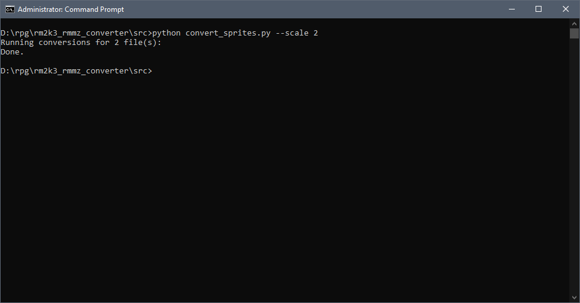
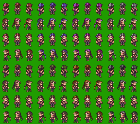
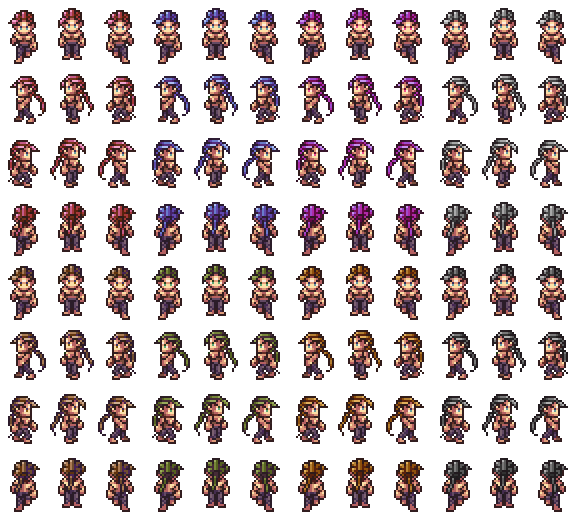

# RPG Maker 2003 -> MZ Player Sprite Converter
This repository contains simple Python scripts to perform batch conversion of 288x256 PNG player sprite sheets from RPG Maker 2003 to MZ format. These two versions expect different positioning of sprites such that importing an unmodified 2003 file will cause the sprite to face the wrong direction. Overall, the user is able to perform the following:

- Reposition RM2K3 sprites to match the RMMZ format
- Scale up 2003 sprite sheets based on nearest neighbor method
- Add alpha channel to remove solid color backgrounds (this has been removed in RMMZ)

### How to Use
To use this tool, follow the following steps:

1) Place all PNG files to be modified into <tt>src/input_files</tt>
2) Open a command prompt under <tt>src</tt> and run the following:

```sh
python convert_sprites.py --scale N
```

Where <tt>N</tt> is a whole number scaling factor. This can be omitted if no scaling is needed. Output files will be available under <tt>src/output_files</tt>

### Example

This example uses the free spritemight's Sprite Might assets available at https://forums.rpgmakerweb.com/index.php?threads/sprite-might-assets-rpg-maker-2003.76339/ :

Shell:



Input:



Output:

